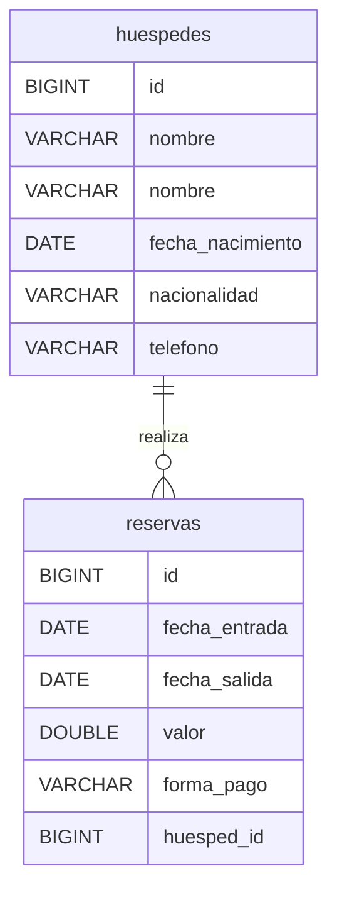
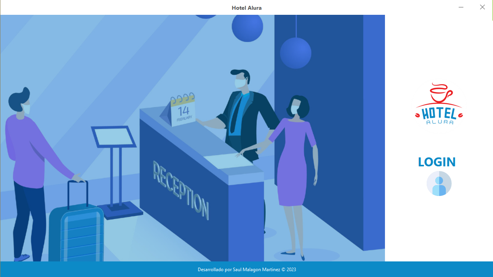
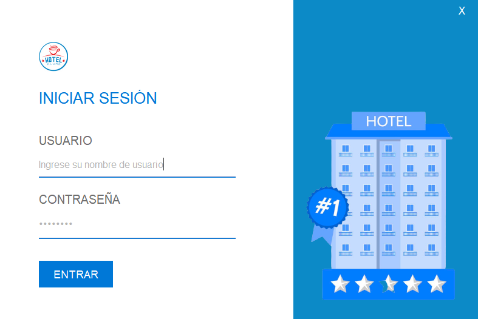
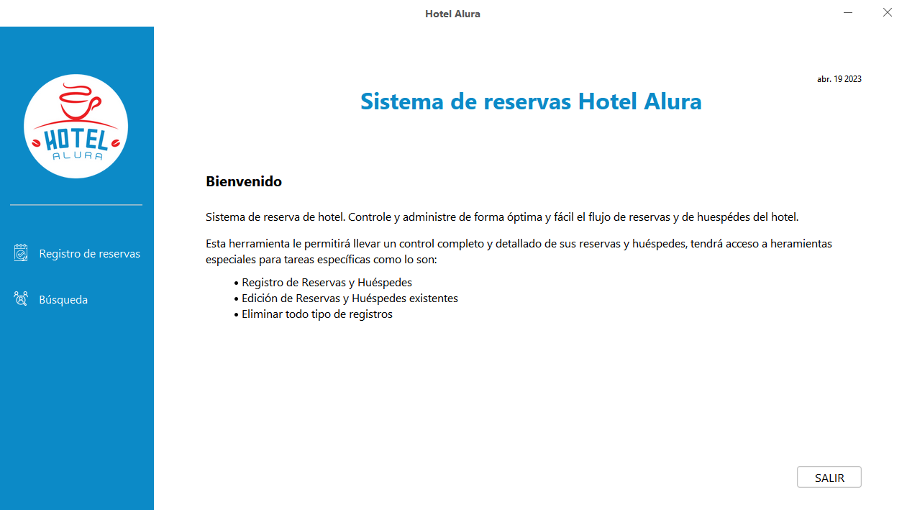
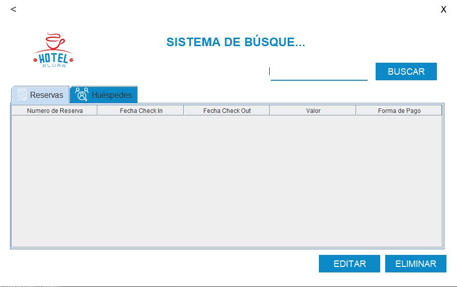
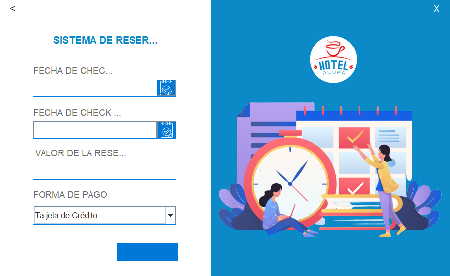
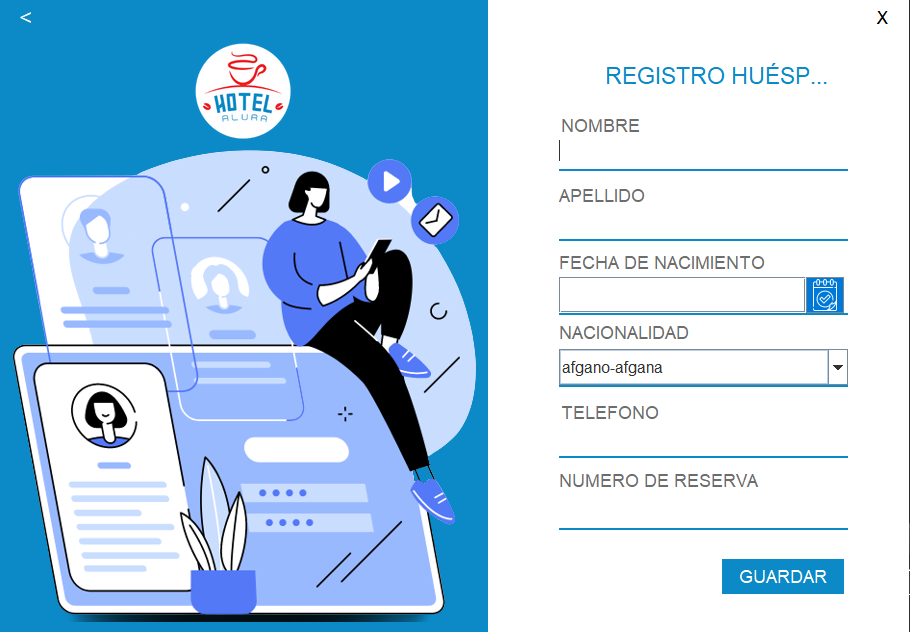
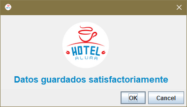

# Challenge ONE | Java | Back-end | Hotel Alura

     

     
     

---
## 🖥️ Tecnologías Utilizadas:

- JCalendar
- JDBC
- c3p0

---

**Para este desafío, se nos facilitó el proyecto base con la interfaz ya diseñada, para concentrarnos en la parte lógica de la aplicación.**

---
## 📊 Base de Dados
Para este reto se propusieron dos tablas: **reservas** y **huespedes**. La tabla de reservas debe contener la clave externa *(foreign key)* **huesped_id**.

## Capturas

||||
|-|-|-|
||||
||||
||
