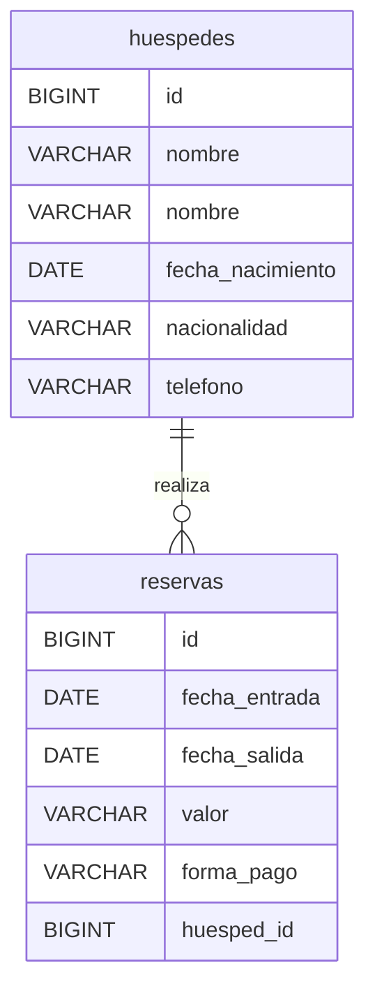
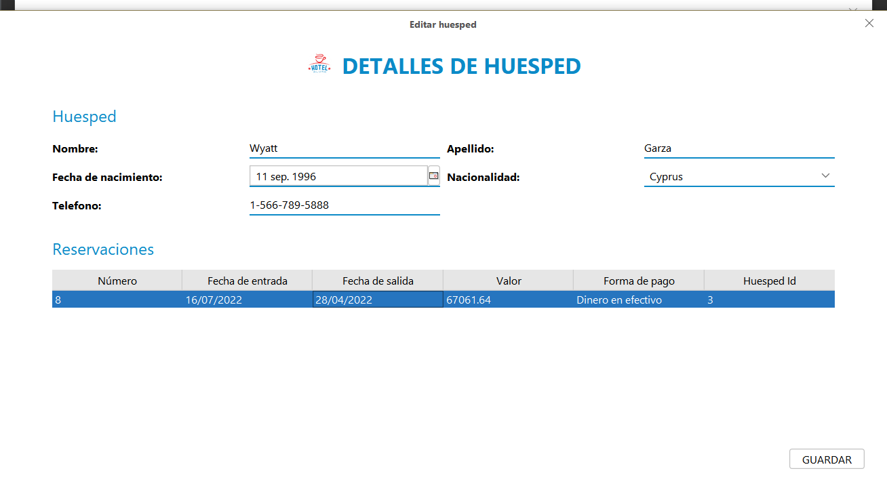
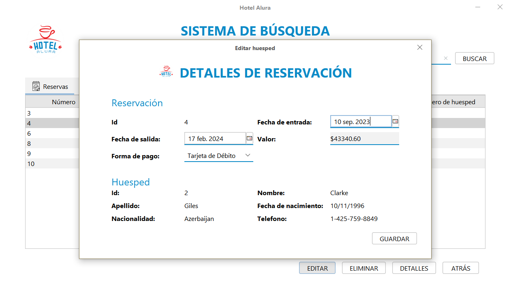
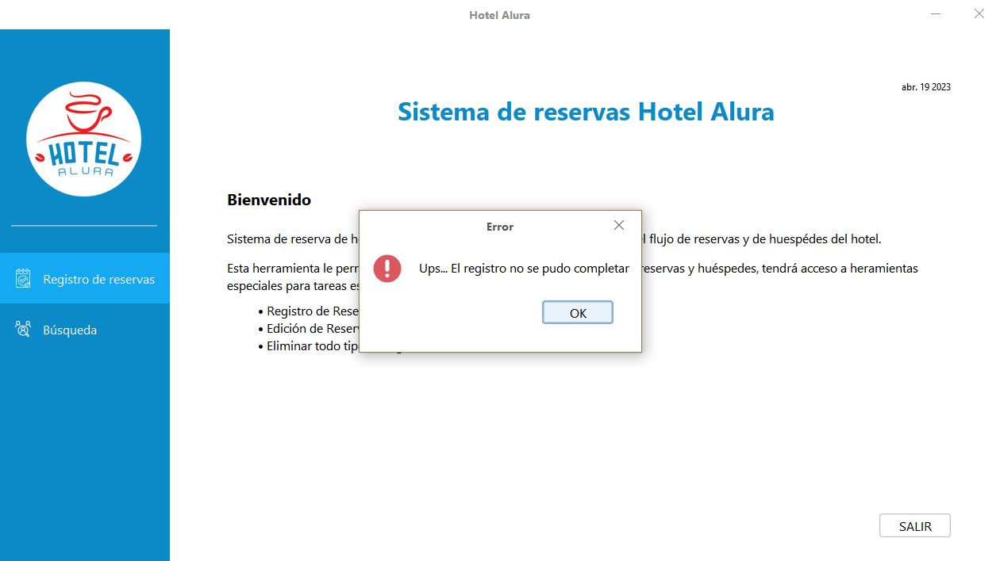
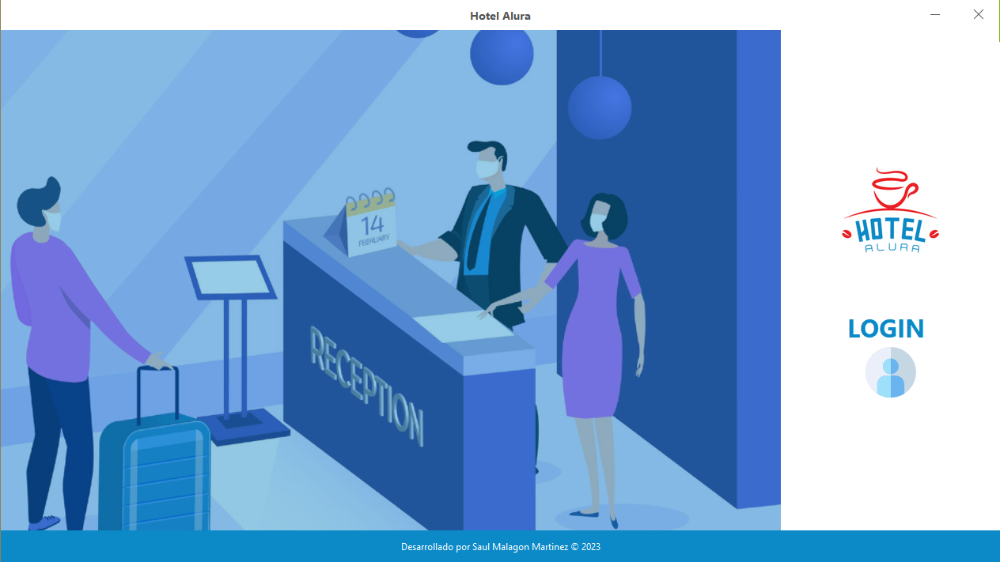
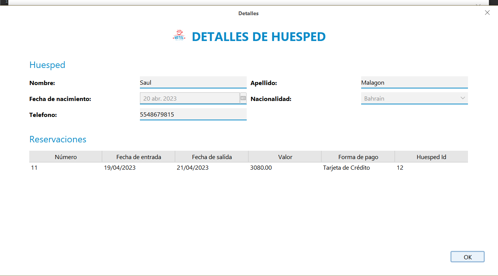
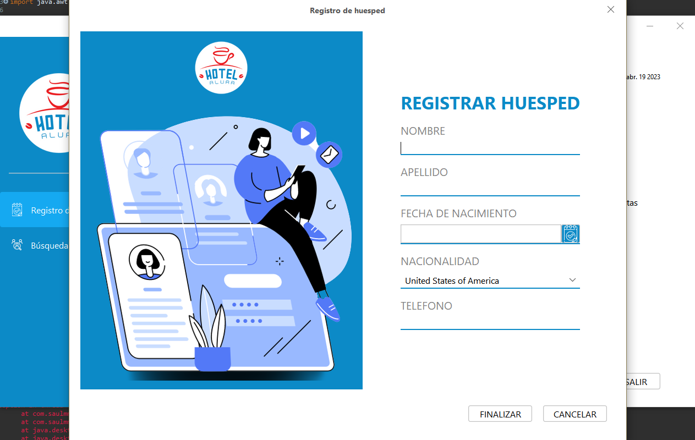

# Challenge ONE | Java | Back-end | Hotel Alura

     

     
     

---
## 🖥️ Tecnologías Utilizadas:

- JCalendar
- JDBC
- c3p0

---

**Para este desafío, se nos facilitó el proyecto base con la interfaz ya diseñada, para concentrarnos en la parte lógica de la aplicación.**

---
## 📊 Base de Dados
Para este reto se propusieron dos tablas: **reservas** y **huespedes**. La tabla de reservas debe contener la clave externa *(foreign key)* **huesped_id**.

```mermaid
erDiagram
     huespedes||--o{ reservas : realiza

     huespedes {
          BIGINT id
          VARCHAR nombre
          VARCHAR nombre
          DATE fecha_nacimiento
          VARCHAR nacionalidad
          VARCHAR telefono
     }

     reservas {
          BIGINT id
          DATE fecha_entrada
          DATE fecha_salida
          VARCHAR valor
          VARCHAR forma_pago
          BIGINT huesped_id
     }

```

## &#128247; Capturas

||||
|-|-|-|
||||
||||
||||
||||

## &#128187; Indicaciones para ejecución desde IDE

Antes de intentar correr el programa, se requiere ejecutar el script sql que viene en la carpeta `/db` de este repositorio.

Para ejecutar el código es necesario asignar las variables de entorno en tu IDE:
- MYSQL_USERNAME=TuUsuarioMySql
- MYSQL_PASSWORD=TuContraseñaMySql

El programa inicia su ejecución desde la clase `App` con el método main.
